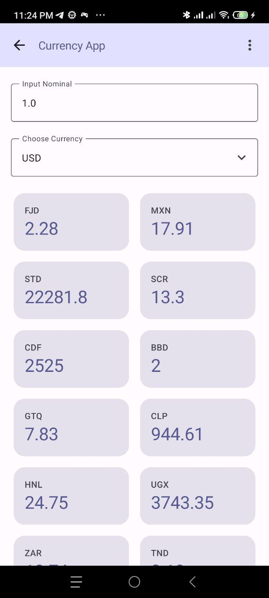
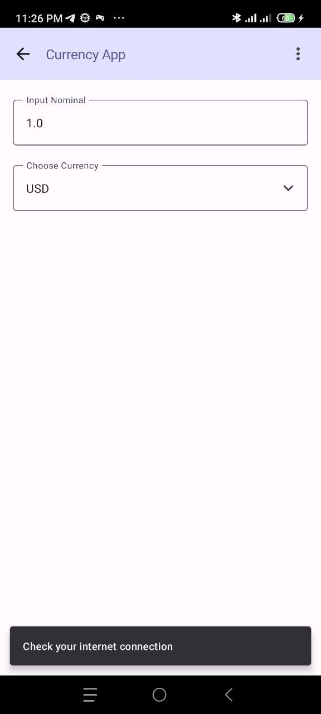
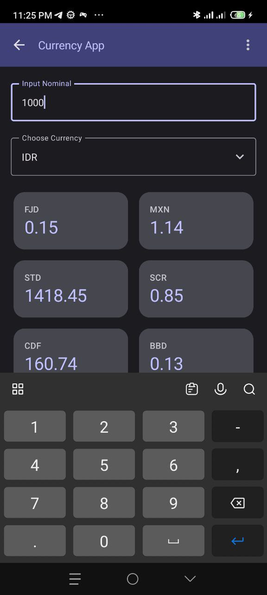
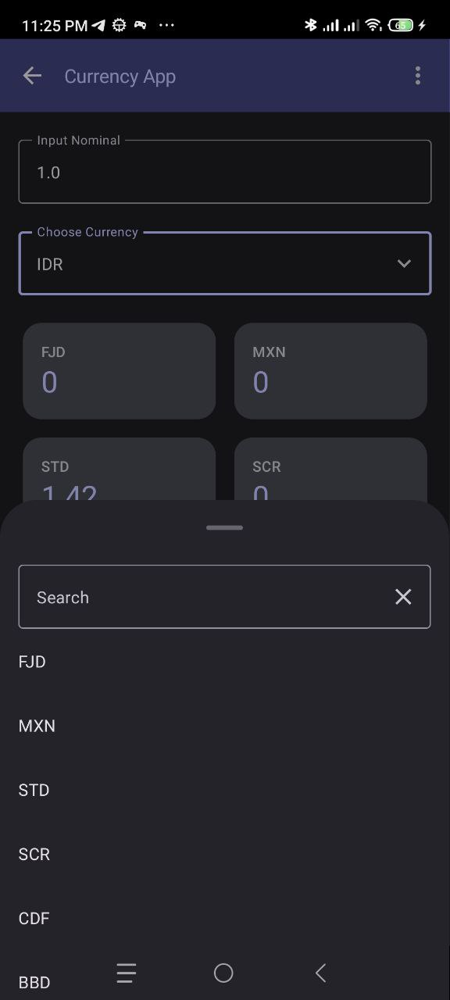
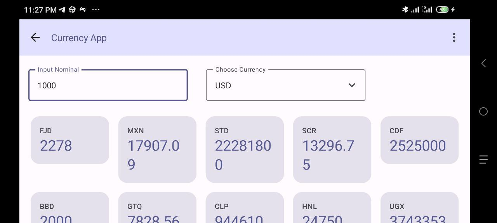

# CurrencyApp
currency app kmm project

## Stack
- Use KMM (kotlin multiplatform module) for shared data and domain layer. 
- Use clean architecture with domain usecase 
- Presentation use compose
- DI shared use koin 
- MVVM pattern 
- Coroutine Flow (Data & domain) & StateFlow (Presentation)
- Unit test use mockKMP for mocking shared module
- Local database (shared) use sqldelight

## Feature
- Converting currency base on input nominal and currency code
- Support darkmode
- Support dynamic layout screen when rotate or large screen
- Filter currency code 
- Offline mode support
- Throtlling checker for limit request to BE

## Todo Items
- Compose ui testing

## Screenshot
### Android

### iOS

